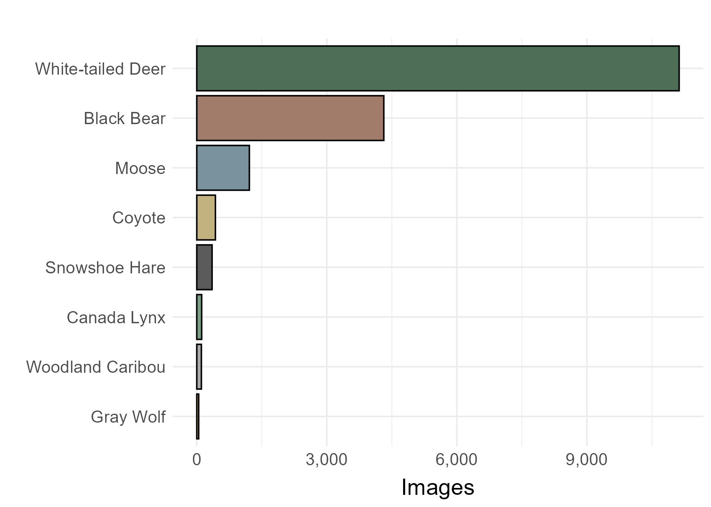
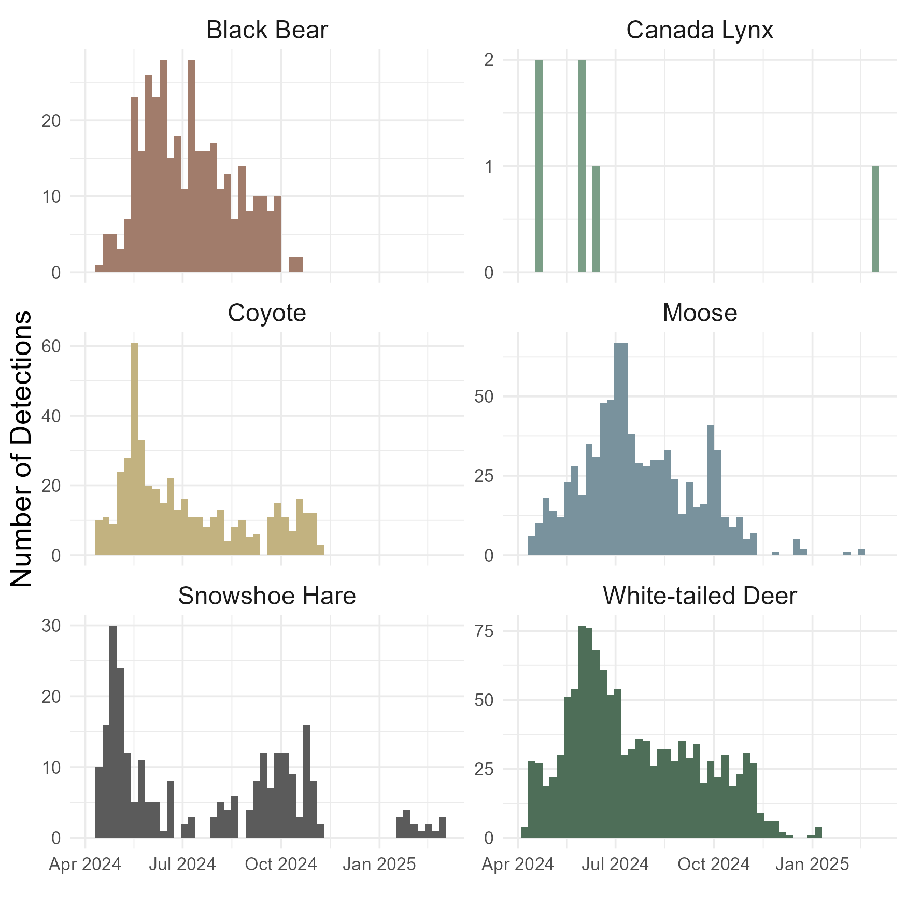

<style>
    body .main-container {
        max-width: 1550px;
    }
</style>

```{r setup, include = TRUE, message = FALSE, warning = FALSE, eval = TRUE, echo = FALSE}

#library(abmi.themes)
library(wildrtrax)
library(tidyverse)
library(leaflet)
library(leaflet.extras)
library(sf)
library(activity)
library(overlap)

load("MNA Region 1 Data Objects.RData")

#add_abmi_fonts()

```

## Project Introduction

Describe the community and it's camera monitoring program. 

Include some fun photos of the setup and the species.

The project on WildTrax can be accessed here:

```{r images}


```

## Camera Locations

<br>

```{r map, echo = FALSE, cache = TRUE, fig.align="center", out.width="100%", eval=TRUE, include=TRUE, echo=FALSE, fig.height=8}

cam <- makeAwesomeIcon(
  icon = "camera",
  iconColor = "black",
  library = "ion",
  markerColor = "white"
)

location_report |>
  st_as_sf(coords = c("longitude", "latitude"), crs = 4326) |>
  leaflet() |>
  addTiles() |>
  addProviderTiles("Esri.WorldImagery", group = "Satellite Imagery") |>
  addFullscreenControl() |>
  addResetMapButton() |>
  addScaleBar(position = "bottomright", 
              options = scaleBarOptions(imperial = FALSE)) |>
  addMeasure(position = "topleft",
             primaryLengthUnit = "meters",
             primaryAreaUnit = "sqmeters",
             secondaryLengthUnit = "kilometers",
             secondaryAreaUnit = "sqkilometers",
             activeColor = "cornflowerblue",
             completedColor = "cornflowerblue") |>
  addDrawToolbar(position = "topleft",
                 polylineOptions = FALSE,
                 polygonOptions = FALSE,
                 circleOptions = FALSE,
                 rectangleOptions = FALSE,
                 circleMarkerOptions = FALSE,
                 markerOptions = drawMarkerOptions(repeatMode = TRUE, markerIcon = cam),
                 editOptions = editToolbarOptions(edit = TRUE, remove = TRUE)) |>
  
  # Camera Locations
  addAwesomeMarkers(icon = cam,
                    group = "Camera Locations",
                    #options = leafletOptions(pane = "Proposed Cameras"),
                    popup = paste("Location: ", "<b>", location_report$location, "</b>",
                                  "<br>", "<br>",
                                  "Notes:", "<br>"
                                  )) |>
  
  # Layers control
  addLayersControl(overlayGroups = c("Satellite Imagery",
                                     "Camera Locations"),
                   options = layersControlOptions(collapsed = FALSE),
                   position = "topright")

```

<br>

## Camera Operating Times

<br>

Here we display when the cameras were operating so we can check for any discrepancies and failures in the camera deployment. 

```{r}


```

<br>

## Number of Images Collected

The figure below displays the number of images collected on the most common species present in the project. 


```{r img, fig.cap="Total Number of Images Captured By MNA Region 1 2023-2024 Camera Project", fig.align="center", out.width="90%", eval=TRUE, include=TRUE, echo=FALSE}



```

<br>

You can download the figure by clicking [this link](Figures/Number of Images.png){download=true}.

<br>

## Independent Detections Over Time

<br>

```{r ind, fig.cap="Independent Species Detections Captured By MNA Region 1 2023-2024 Camera Project", fig.align="center", out.width="90%", eval=TRUE, include=TRUE, echo=FALSE}



```

You can download the figure by clicking [this link](Figures/Independent Detections.png){download=true}.

<br>

### Species-specific figures {.tabset}

Here is displayed each of the species independent detections individually.

#### White-tailed Deer {-}

```{r wtd, fig.cap="Independent Detections for White-tailed Deer", fig.align="center", out.width="100%", eval=TRUE, include=TRUE, echo=FALSE}


```
Download figure with [this link](Figures/Independent Detections White-tailed Deer.png){download=true}.
<br>

#### Black Bear {-}

```{r bb, fig.cap="Independent Detections for Black Bear", fig.align="center", out.width="100%", eval=TRUE, include=TRUE, echo=FALSE}


```
Download figure with [this link](Figures/Independent Detections Black Bear.png){download=true}.
<br>


#### Canada Lynx {-}

```{r cl, fig.cap="Independent Detections for Canada Lynx", fig.align="center", out.width="100%", eval=TRUE, include=TRUE, echo=FALSE}


```
Download figure with [this link](Figures/Independent Detections Canada Lynx.png){download=true}.
<br>

#### Coyote {-}

```{r coy, fig.cap="Independent Detections for Coyote", fig.align="center", out.width="100%", eval=TRUE, include=TRUE, echo=FALSE}


```
Download figure with [this link](Figures/Independent Detections Coyote.png){download=true}.
<br>

#### Gray Wolf {-}

```{r gw, fig.cap="Independent Detections for Gray Wolf", fig.align="center", out.width="100%", eval=TRUE, include=TRUE, echo=FALSE}


```
Download figure with [this link](Figures/Independent Detections Gray Wolf.png){download=true}.
<br>

#### Moose {-}

```{r moo, fig.cap="Independent Detections for Moose", fig.align="center", out.width="100%", eval=TRUE, include=TRUE, echo=FALSE}


```
Download figure with [this link](Figures/Independent Detections Moose.png){download=true}.
<br>

#### Snowshoe Hare {-}

```{r sh, fig.cap="Independent Detections for Snowshoe Hare", fig.align="center", out.width="100%", eval=TRUE, include=TRUE, echo=FALSE}


```
Download figure with [this link](Figures/Independent Detections Snowshoe Hare.png){download=true}.
<br>

#### Woodland Caribou {-}

```{r wc, fig.cap="Independent Detections for Woodland Caribou", fig.align="center", out.width="100%", eval=TRUE, include=TRUE, echo=FALSE}


```
Download figure with [this link](Figures/Independent Detections Woodland Caribou.png){download=true}.
<br>

## Diel Patterns

```{r diel}

wtd <- rad_time |>
  filter(species_common_name == "White-tailed Deer") |>
  pull(rad_time)

gw <- rad_time |>
  filter(species_common_name == "Gray Wolf") |>
  pull(rad_time)

densityPlot(gw, col = "black", lty = 1, main = "White-tailed Deer")


```


## Integration with OSM Monitoring


### Regional BADR results


## ABMI Species Model Predictions in Study Area


