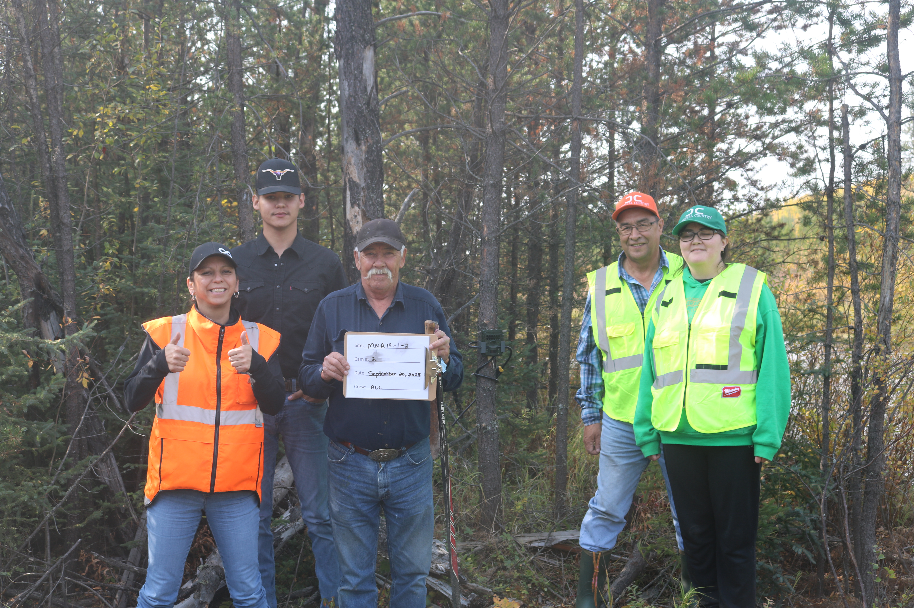

{style="float:left`;" fig-alt="Photo of the ocean" fig-align="center"}

# Project Introduction

```{r}
#| label: load-packages and authenticate
#| include: false
#| echo: false
#| eval: true
#| warning: false
#| message: false

# Load packages
library(tidyverse)
library(leaflet)
library(leaflet.extras)
library(sf)
library(activity)
library(overlap)
library(corrplot)
library(here)

# Community acronym
com_acr <- "OMGD19"

# Community full name
com_full <- "Otipemisiwak Métis Government Lac La Biche District 19"

load(here(paste0("Communities/", com_acr, "/", com_acr, " Data Objects.RData")))

species <- c(
  "White-tailed Deer", 
  "Black Bear", 
  "Moose", 
  "Coyote", 
  "Snowshoe Hare",
  "Canada Lynx", 
  "Woodland Caribou", 
  "Gray Wolf")

species_colours <- c(
  "#4E6E58",  
  "#A17C6B",  
  "#79929D",  
  "#C2B280",  
  "#5B5B5B",  
  "#7B9E87",  
  "#A9A9A9",  
  "#D6B88A"   
)

names(species_colours) <- species

```

Members of the **`r com_full`** (`r com_acr`) are interested in understanding the changes in wildlife condition and behaviour that they are noticing on the land. The health and abundance of wildlife populations is relied upon by members of `r com_acr` to support a traditional way of life. To ensure the sustainability of this way of life it is important to understand both how many animals, such as moose, are available for harvest every year and what the drivers of change are in the abundance of wildlife over time. These concerns led to the initiation of this wildlife monitoring program in 2023. <br> <br> In 2023, the `r com_full` created a Community Knowledge Committee comprising both elders and youths to lead this project. This Community Knowledge Committee shares knowledge and disseminates information about the program across age ranges and the region. The Committee engages with ABMI staff about program updates, monitoring methods, study design, site locations, analysis, and integration of Indigenous knowledge indicators. <br> <br> The Committee deployed 18 cameras between October 2023 and October 2024. These cameras were primarily deployed along the Old Conklin Road near Lac La Biche (see Figure below) in clusters of 4 cameras. Cameras were deployed based on the knowledge of the land, areas of interest by the committee, and areas of oil sands disturbance. <br> <br> The goal of the program is to evaluate the specific oil sands disturbance type of pipelines and roads compared to reference (low disturbance) areas. To achieve this, 2 clusters of 4 cameras were deployed along pipeline right of ways and roads at distances up to 100 metres. Additionally, 2 clusters of cameras were deployed in reference areas picked by the community.

## Camera Refresh and Image Processing

THe wildlife cameras were refreshed (new SD cards and batteries) in the field by the Community Knowledge Committee in 2024 and 2025. The CKC members uploaded and tagged all of the camera images on the online platform [WildTrax](www.wildtrax.ca)[^1]. Initial results from this first year of data collected at the 18 cameras are presented here in this report.

[^1]: `r com_acr` images and wildlife tags can be viewed using [this link](https://portal.wildtrax.ca/home/camera-deployments.html?sensorId=CAM&projectId=2929) to the WildTrax platform. Note that viewers will need to have a WildTrax account with the appropriate permissions from the community and be logged in to see the images.

# Camera Locations

The following interactive map can be used to explore the locations of the cameras deployed by `r com_full`. Satellite imagery can switched on and off using the button in the top right of the top.

```{r}
#| label: camera locations
#| include: true
#| echo: false
#| eval: true
#| warning: false
#| message: false

cam <- makeAwesomeIcon(
  icon = "camera",
  iconColor = "black",
  library = "ion",
  markerColor = "white"
)

location_report |>
  st_as_sf(coords = c("longitude", "latitude"), crs = 4326) |>
  leaflet() |>
  addTiles() |>
  addProviderTiles("Esri.WorldImagery", group = "Satellite Imagery") |>
  addFullscreenControl() |>
  addResetMapButton() |>
  addScaleBar(position = "bottomright", 
              options = scaleBarOptions(imperial = FALSE)) |>
  addMiniMap(position = "bottomright") |>
  
  # Camera Locations
  addAwesomeMarkers(icon = cam,
                    group = "Camera Locations",
                    #options = leafletOptions(pane = "Proposed Cameras"),
                    popup = paste("Location: ", "<b>", location_report$location, "</b>",
                                  "<br>", "<br>",
                                  "Notes:", "<br>"
                                  )) |>
  
  # Layers control
  addLayersControl(overlayGroups = c("Satellite Imagery",
                                     "Camera Locations"),
                   options = layersControlOptions(collapsed = FALSE),
                   position = "topright") |>
  
  hideGroup("Satellite Imagery")
  
```

# Number of Images Collected

The figure below displays the total number of images collected on the most common 8 species present in the `r com_full` camera project.

```{r}
#| label: number of images by species
#| include: true
#| echo: false
#| eval: true
#| warning: false
#| message: false

knitr::include_graphics(here("Communities/OMGD19/Figures/Number of Images.png"))

```

For a complete list of all the species, you can go to the project on WildTrax and click on the 'Species Verification' tab of the project.

# Independent Detections Over Time

With camera data, one useful metric to track over time is the number of "independent" detections captured for each species. In this case, an independent detection is defined as an image or series of images captured for a given species within a specific time interval. In the figure below we present the number of independent detections for each of the 8 main species using a 30 minute time interval; that is, images captured within 30 minutes of each other count toward a single detection and images with a gap of greater than 30 minutes between them count as multiple independent detections. Images that are captured of the same species over less than 30 minutes are assumed to be of the same individual, or group of individuals.

```{r}
#| label: independent detections
#| include: true
#| echo: false
#| eval: true
#| warning: false
#| message: false

knitr::include_graphics(here("Communities/OMGD19/Figures/Independent Detections.png"))

```

Here is displayed each of the species independent detections individually, which can be toggled through using the tabs below.

::: panel-tabset
### White-tailed Deer {.unnumbered}

```{r}
#| label: independent detections wtd
#| include: true
#| echo: false
#| eval: true
#| warning: false
#| message: false

knitr::include_graphics(here("Communities/OMGD19/Figures/Independent Detections White-tailed Deer.png"))

```

### Black Bear {.unnumbered}

```{r}
#| label: independent detections bb
#| include: true
#| echo: false
#| eval: true
#| warning: false
#| message: false

knitr::include_graphics(here("Communities/OMGD19/Figures/Independent Detections Black Bear.png"))

```

### Canada Lynx {.unnumbered}

```{r}
#| label: independent detections cl
#| include: true
#| echo: false
#| eval: true
#| warning: false
#| message: false

knitr::include_graphics(here("Communities/OMGD19/Figures/Independent Detections Canada Lynx.png"))

```

### Coyote {.unnumbered}

```{r}
#| label: independent detections coyote
#| include: true
#| echo: false
#| eval: true
#| warning: false
#| message: false

knitr::include_graphics(here("Communities/OMGD19/Figures/Independent Detections Coyote.png"))

```

### Gray Wolf {.unnumbered}

```{r}
#| label: independent detections gw
#| include: true
#| echo: false
#| eval: true
#| warning: false
#| message: false

knitr::include_graphics(here("Communities/OMGD19/Figures/Independent Detections Gray Wolf.png"))

```

### Moose {.unnumbered}

```{r}
#| label: independent detections moose
#| include: true
#| echo: false
#| eval: true
#| warning: false
#| message: false

knitr::include_graphics(here("Communities/OMGD19/Figures/Independent Detections Moose.png"))

```

### Snowshoe Hare {.unnumbered}

```{r}
#| label: independent detections hare
#| include: true
#| echo: false
#| eval: true
#| warning: false
#| message: false

knitr::include_graphics(here("Communities/OMGD19/Figures/Independent Detections Snowshoe Hare.png"))

```

### Woodland Caribou {.unnumbered}

```{r}
#| label: independent detections wc
#| include: true
#| echo: false
#| eval: true
#| warning: false
#| message: false

knitr::include_graphics(here("Communities/OMGD19/Figures/Independent Detections Woodland Caribou.png"))

```
:::

# Temporal Activity Patterns

Given that camera traps operate 24 hours a day, 7 days a week, and can record animal motion down to second-level precision, they represent a powerful tool to explore and contrast the activity patterns of the species they detect. Such analyses can give insight into competition, predation, and coexistence.

In this section we present the temporal (diel) activity patterns for each of the 8 species from the `r com_full` cameras.

::: panel-tabset

## White-tailed Deer

```{r}
#| label: temporal patterns wtd
#| include: true
#| echo: false
#| eval: true
#| warning: false
#| message: false

wtd <- rad_time |>
  filter(species_common_name == "White-tailed Deer") |>
  pull(rad_time)

densityPlot(wtd, col = species_colours["White-tailed Deer"], 
            lty = 1, 
            lwd = 2,
            main = "White-tailed Deer")

```

White-tailed deer demonstrate a diurnal activity pattern, with peaks both during the dawn (6am-9am) and dusk (7pm) periods of the day.  

## Black Bear

```{r}
#| label: temporal patterns bb
#| include: true
#| echo: false
#| eval: true
#| warning: false
#| message: false

wtd <- rad_time |>
  filter(species_common_name == "Black Bear") |>
  pull(rad_time)

densityPlot(wtd, col = species_colours["Black Bear"], 
            lty = 1, 
            lwd = 2,
            main = "Black Bear")
```

Black Bear are more active in the evenings and overnight. 

## Canada Lynx

```{r}
#| label: temporal patterns cl
#| include: true
#| echo: false
#| eval: true
#| warning: false
#| message: false

cl <- rad_time |>
  filter(species_common_name == "Canada Lynx") |>
  pull(rad_time)

densityPlot(cl, col = species_colours["Canada Lynx"], 
            lty = 1, 
            lwd = 2,
            main = "Canada Lynx")

```

## Coyote

```{r}
#| label: temporal patterns coyote
#| include: true
#| echo: false
#| eval: true
#| warning: false
#| message: false

coy <- rad_time |>
  filter(species_common_name == "Coyote") |>
  pull(rad_time)

densityPlot(coy, col = species_colours["Coyote"], 
            lty = 1, 
            lwd = 2,
            main = "Coyote")

```

Coyotes are primarily active during the nighttime. 

## Gray Wolf

```{r}
#| label: temporal patterns gw
#| include: true
#| echo: false
#| eval: true
#| warning: false
#| message: false

gw <- rad_time |>
  filter(species_common_name == "Gray Wolf") |>
  pull(rad_time)

densityPlot(gw, col = species_colours["Gray Wolf"], 
            lty = 1, 
            lwd = 2,
            main = "Gray Wolf")

```

Wolves are primarily active at dusk.

## Moose

```{r}
#| label: temporal patterns moose
#| include: true
#| echo: false
#| eval: true
#| warning: false
#| message: false

moo <- rad_time |>
  filter(species_common_name == "Moose") |>
  pull(rad_time)

densityPlot(moo, col = species_colours["Moose"], 
            lty = 1, 
            lwd = 2,
            main = "Moose")

```

Moose activity peaks during the nighttime and dawn periods, with much less activity throughout the day. 

## Snowshoe Hare

```{r}
#| label: temporal patterns sh
#| include: true
#| echo: false
#| eval: true
#| warning: false
#| message: false

sh <- rad_time |>
  filter(species_common_name == "Snowshoe Hare") |>
  pull(rad_time)

densityPlot(sh, col = species_colours["Snowshoe Hare"], 
            lty = 1, 
            lwd = 2,
            main = "Snowshoe Hare")

```

Snowshoe Hare are most active at night, with very few detections on the cameras during the day.  

## Woodland Caribou

```{r}
#| label: temporal patterns wc
#| include: true
#| echo: false
#| eval: true
#| warning: false
#| message: false

wc <- rad_time |>
  filter(species_common_name == "Woodland Caribou") |>
  pull(rad_time)

densityPlot(wc, col = species_colours["Woodland Caribou"], 
            lty = 1, 
            lwd = 2,
            main = "Woodland Caribou")

```

Caribou are most active during the midday. 

:::

## Species Co-Occurences

Camera trap data are being increasingly used to model multiple species communities, and we can use this data to explore the co-occurrence patterns of the species in the community.

The plot below displays pairwise correlations between the species on the left and the species on the top row. Blue colours indicate positive correlation, meaning that the two species are positively associated with one another. Red colours indicate the opposite, that where you have high counts of one species you likely have low counts of the other (and vice versa).

```{r}
#| label: species co-occurrences
#| include: true
#| echo: false
#| eval: true
#| warning: false
#| message: false

par(mfrow=c(1,1))

corrplot(M, method = "color",
         type = "upper",
         order = "hclust",
         tl.col = "black", tl.srt = 45,
         diag = FALSE)

```


